# AWS MERN To-Do Full-Stack Application

## Project Overview

In this project, I deployed and configured a complete **MERN stack To-Do web application on an AWS EC2 Ubuntu server**.

Rather than treating the project as four technologies installed beside one another, I focused on understanding how the different layers of a full-stack application communicate.

The application brings together:

| Layer          | Technology          | Responsibility                            |
| -------------- | ------------------- | ----------------------------------------- |
| Database       | MongoDB Atlas       | Stores application data                   |
| Backend        | Express.js          | Provides API routes and application logic |
| Runtime        | Node.js             | Runs the backend application              |
| Frontend       | React               | Provides the user interface               |
| Infrastructure | AWS EC2             | Hosts the application environment         |
| Networking     | AWS Security Groups | Controls access to application ports      |
| API Testing    | Postman             | Validates backend endpoints independently |

The main lesson I took from this project was understanding the complete path a request takes through a modern web application.

```text
User
  |
  v
React Frontend
  |
  | HTTP/API Request
  v
Express API
  |
  v
Node.js
  |
  v
MongoDB Atlas
  |
  v
Database Response
  |
  v
Express API
  |
  v
React UI
```

This helped me move beyond simply running commands to understanding how infrastructure, networking, application services and databases work together.

---

# Architecture

The application was deployed using the following logical architecture:

```text
                         Internet
                            |
                            v
                   AWS Security Group
                            |
                            v
                     Ubuntu EC2
                            |
             +--------------+--------------+
             |                             |
             v                             v
      React Frontend                Express Backend
        Port 3000                     Port 5000
                                           |
                                           v
                                        Node.js
                                           |
                                           v
                                     MongoDB Atlas
```

I separated the application mentally into infrastructure, frontend, backend and database layers because this makes both deployment and troubleshooting easier.

If the application fails, I can investigate the affected layer rather than making unrelated changes throughout the stack.

---

# Phase 1: Provisioning the AWS Infrastructure

## Step 1: Creating the EC2 Instance

I began by provisioning an Ubuntu EC2 instance in AWS.

The EC2 instance provides the compute environment on which the Node.js application and supporting services run.

At this stage I paid attention to the instance state, networking information, public IP address and Security Group because these details would affect how I connected to and exposed the application later.

### Evidence: AWS EC2 Instance


This became the infrastructure foundation for the MERN application.

---

## Step 2: Verifying EC2 Network Details

Before installing the application stack, I confirmed that the instance was running and reviewed its network information.

### Evidence: EC2 Instance Network Details

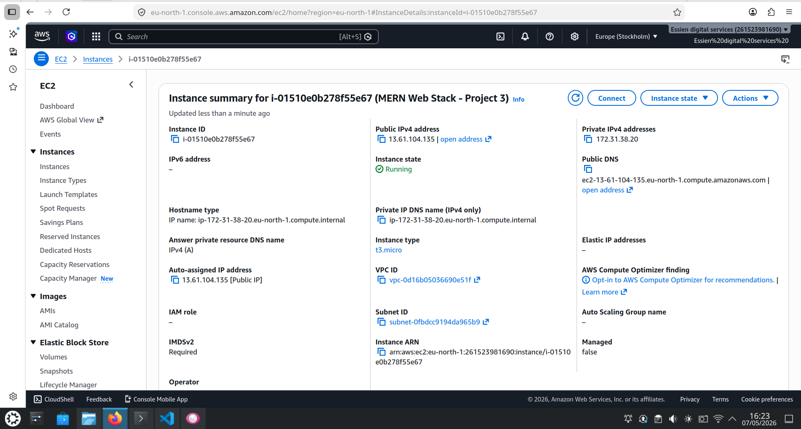

This step reinforced something important for me: application troubleshooting begins below the application itself.

If the underlying EC2 instance is unavailable or incorrectly configured, troubleshooting React or Express would be pointless.

---

# Phase 2: Preparing the Node.js Runtime

## Step 3: Verifying Node.js and npm

Because both my backend tooling and frontend development workflow depend on Node.js, I verified the Node and npm versions before running the application.

Typical checks include:

```bash
node --version
npm --version
```

### Evidence: Node.js and npm Versions

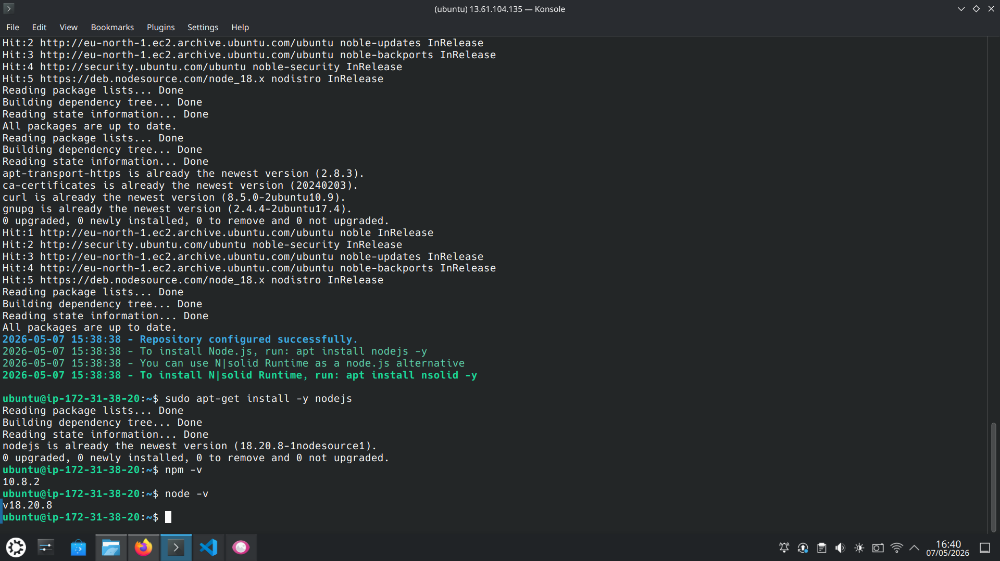

I learned to verify the runtime before installing or debugging dependencies because an incompatible Node.js version can create application problems that initially appear to be code-related.

---

# Phase 3: Building and Testing the Express Backend

## Step 4: Starting the Express Server

I configured and started the Express backend.

The backend is responsible for receiving API requests, processing application logic and communicating with the MongoDB database.

### Evidence: Express Server Running

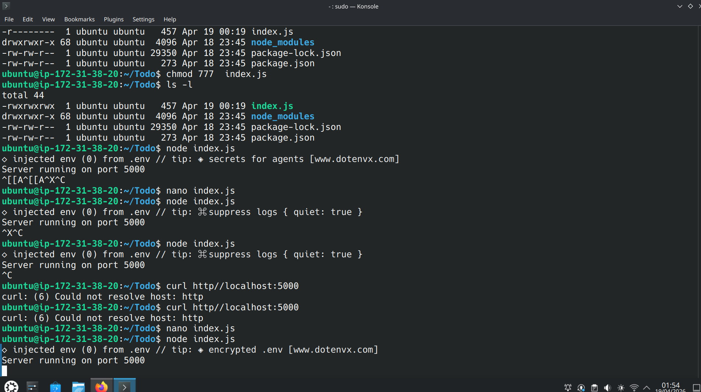

Seeing the server start successfully confirmed that the Node.js process and Express application could run inside the EC2 instance.

However, I also understood that a process running successfully inside EC2 does **not automatically mean it is reachable from outside AWS**.

That required a separate network validation.

---

## Step 5: Testing Express Through the Browser

I accessed the backend through the browser to confirm that the Express application could respond to external requests.

### Evidence: Express Browser Test

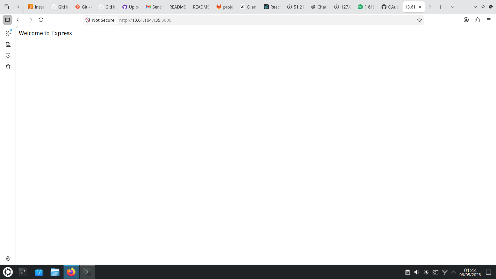

At this point I had verified more than just Express itself.

A successful browser response showed that the request was travelling through:

```text
Browser
   |
   v
AWS Network
   |
   v
EC2
   |
   v
Express / Node.js
```

---

# Phase 4: Configuring AWS Networking

## Step 6: Allowing Backend Traffic on Port 5000

My Express backend was configured to listen on port **5000**.

A service listening on a port inside Linux is still unreachable externally if AWS blocks the network traffic.

I therefore configured the EC2 Security Group to allow the required traffic to the backend.

### Evidence: Security Group Port 5000

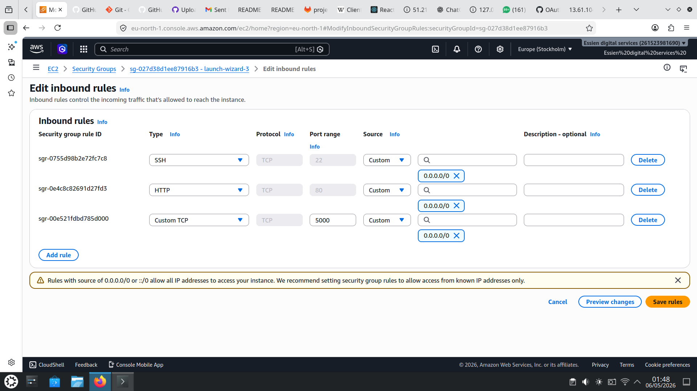

This phase strengthened my understanding of the difference between:

```text
Application listening successfully
```

and:

```text
Application reachable from the network
```

Both conditions have to be true.

---

# Phase 5: Creating the API Layer

## Step 7: Configuring Express API Routes

I implemented the API routing layer used by the application.

### Evidence: API Routes

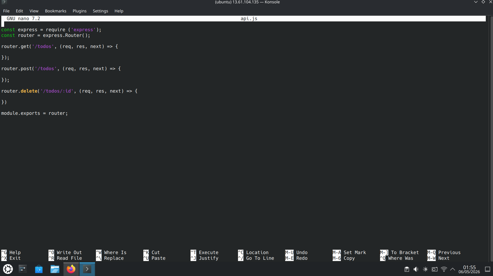

I understood the routes as the interface between the frontend and backend.

The React frontend should not need to know how MongoDB stores data internally. It communicates with defined API endpoints, while Express handles the application and database logic behind those endpoints.

Conceptually:

```text
React
   |
   | API Request
   v
Express Route
   |
   v
Application Logic
   |
   v
MongoDB
```

This separation makes the application easier to understand, test and troubleshoot.

---

# Phase 6: Preparing MongoDB Atlas

## Step 8: Creating the MongoDB Cluster

Instead of running the application's database directly on the EC2 instance, I used **MongoDB Atlas** as the database platform.

I created the MongoDB cluster that would store the application's persistent data.

### Evidence: MongoDB Cluster Setup

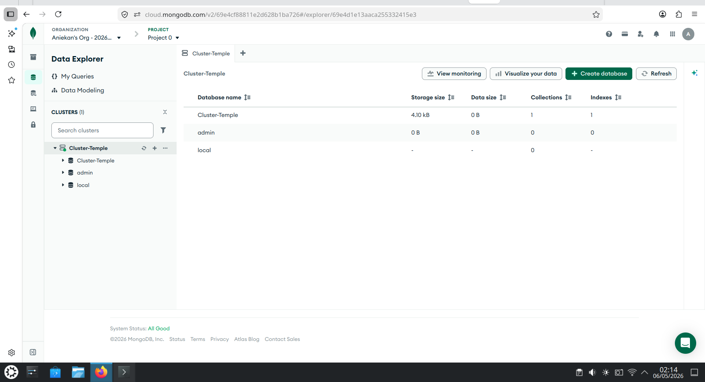

This helped me understand the difference between the application server and database service.

My EC2 server runs the application, while MongoDB Atlas provides the database layer separately.

---

## Step 9: Verifying the MongoDB Atlas Cluster

After configuring the cluster, I verified that the MongoDB Atlas environment was available.

### Evidence: MongoDB Atlas Cluster

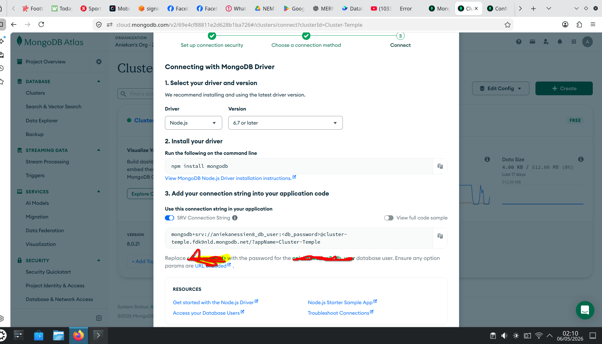

At this stage my application architecture had become:

```text
React
   |
Express
   |
Node.js
   |
Internet
   |
MongoDB Atlas
```

The next challenge was securely connecting the application to that database.

---

# Phase 7: Configuring the Database Connection

## Step 10: Using Environment Configuration

I configured the database connection using environment variables rather than embedding connection details directly inside the application logic.

### Evidence: Environment Database Connection

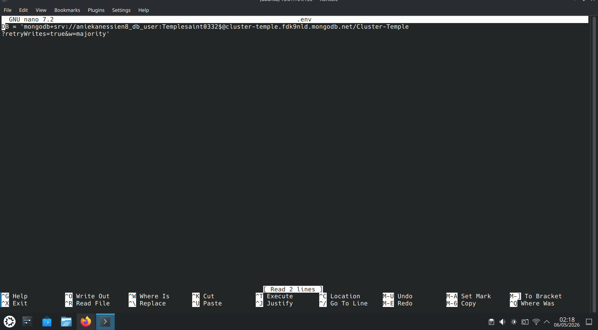

This helped reinforce an important application deployment principle for me:

**configuration and secrets should be separated from application code.**

For example, an application may reference an environment variable:

```text
MONGO_URI
```

instead of placing an actual database credential directly into source code.

This makes the application easier to move between development and production environments while reducing the risk of exposing credentials through source control.

---

## Step 11: Connecting the Application Layers

After configuring the database connection, I connected the frontend, backend and database components.

### Evidence: Frontend, Backend and Database Connection

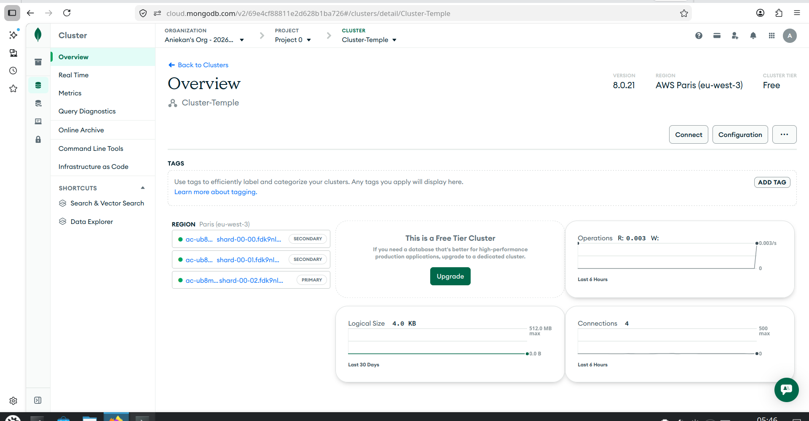

At this point I could visualize the application as a complete data flow:

```text
React Frontend
      |
      v
Express API
      |
      v
Node.js Backend
      |
      v
MongoDB Atlas
```

A user's action in the browser could now trigger an API request, allow the backend to interact with the database, and return the resulting data to the frontend.

---

## Step 12: Verifying MongoDB Connectivity

I then verified that the application could successfully communicate with MongoDB.

### Evidence: Successful MongoDB Connection

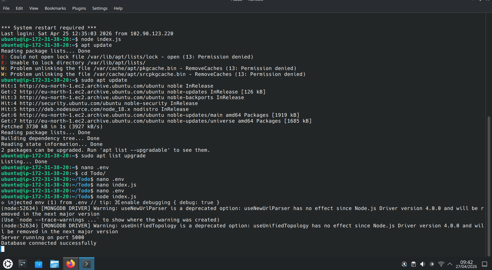

This was an important validation point because it confirmed that the database connection configuration, application logic and MongoDB environment were working together.

---

# Phase 8: Testing the API Independently

## Step 13: Testing With Postman

Before depending completely on the React frontend, I tested the backend API using **Postman**.

### Evidence: Postman API Testing

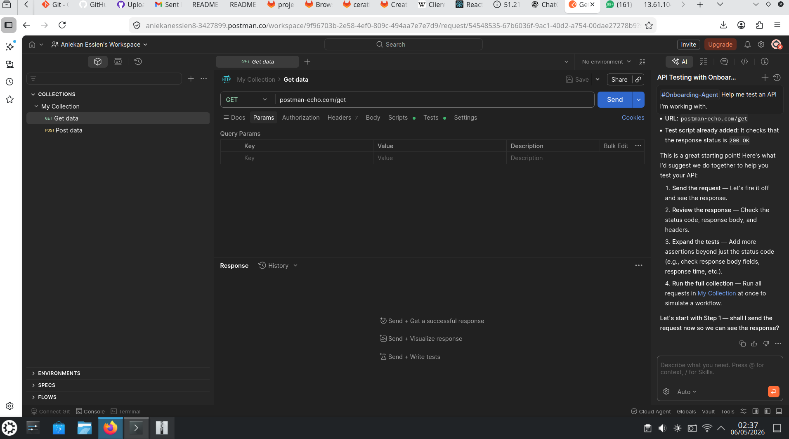

This was an important troubleshooting technique.

If an API request succeeds in Postman but fails from React, I know the Express endpoint itself is probably functioning and can focus my investigation on frontend integration, request formatting or browser-related issues.

If the request also fails in Postman, I can concentrate on the backend, database or network layer instead.

That separation helps reduce guesswork.

---

# Phase 9: Running the Full Stack

## Step 14: Starting the Frontend Development Server

The frontend application was made available through its development server on port **3000**.

### Evidence: Application Server on Port 3000

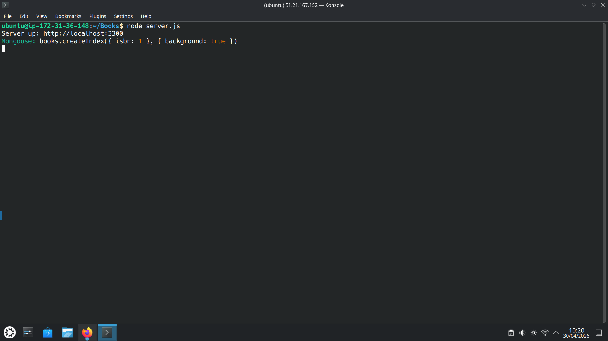

This represented the client-facing side of the MERN application.

At this point the two primary application services were:

```text
Frontend
React
Port 3000

Backend
Express / Node.js
Port 5000
```

---

## Step 15: Running Frontend and Backend Together

Rather than starting the frontend and backend separately each time, I used `concurrently` to run both development processes together.

### Evidence: Concurrent Full-Stack Application

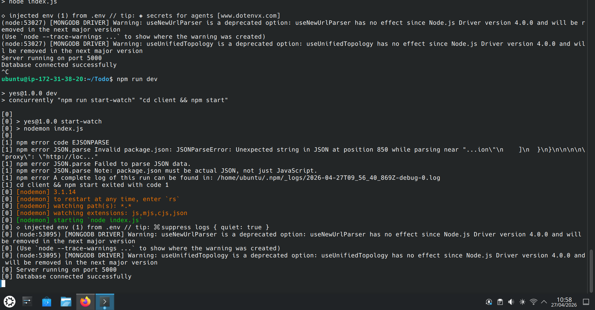

This gave me a single development workflow for starting the complete application stack.

Conceptually:

```text
npm run dev
     |
     v
concurrently
   /      \
  v        v
React    Express
3000      5000
```

This final step demonstrated that the frontend and backend could operate at the same time as parts of one full-stack application.

---

# End-to-End Request Flow

By completing the project, I developed a clearer understanding of what happens when a user interacts with the application.

```text
1. User interacts with the React interface
                  |
                  v
2. React sends an HTTP request
                  |
                  v
3. Express receives the request
                  |
                  v
4. The appropriate API route handles it
                  |
                  v
5. Node.js executes the backend logic
                  |
                  v
6. The backend communicates with MongoDB Atlas
                  |
                  v
7. MongoDB returns the requested data
                  |
                  v
8. Express returns an API response
                  |
                  v
9. React updates the user interface
```

Understanding this flow has made it easier for me to reason about where a problem may exist when the application does not behave as expected.

---

# How I Would Troubleshoot This Application

One of the strongest lessons from this project was learning not to treat a full-stack failure as one single problem.

My troubleshooting approach would be:

```text
Is the EC2 instance running?
            |
            v
Is the required AWS network access configured?
            |
            v
Is Node.js running correctly?
            |
            v
Is the Express backend listening?
            |
            v
Does the API respond independently in Postman?
            |
            v
Can the backend connect to MongoDB?
            |
            v
Is the React frontend running?
            |
            v
Is React calling the correct API endpoint?
            |
            v
Can the complete application flow succeed?
```

This layered approach helps me isolate the failing component instead of changing multiple parts of the application at once.

---

# What I Learned From the Project

This project improved my understanding of how development and infrastructure overlap in a full-stack environment.

I learned that successful deployment requires more than writing application code.

The application depends on:

```text
Cloud Infrastructure
       +
Linux Environment
       +
Network Configuration
       +
Application Runtime
       +
Backend API
       +
Database Connectivity
       +
Frontend Integration
       =
Working Full-Stack Application
```

I also gained practical experience testing individual layers before attempting to troubleshoot the complete system.

---

# Security Considerations

If I were preparing this environment for production, I would improve it by:

* Restricting unnecessary Security Group rules
* Avoiding unrestricted exposure of development ports
* Keeping MongoDB credentials outside the source code
* Never committing `.env` secrets to GitHub
* Using HTTPS rather than plain HTTP
* Applying least-privilege permissions
* Restricting database network access
* Keeping Node.js dependencies updated
* Validating and sanitizing API input
* Implementing authentication and authorization where required
* Configuring centralized logging
* Implementing database backups

---

# Skills Demonstrated

This project gave me practical experience with:

| Area            | Skills                                            |
| --------------- | ------------------------------------------------- |
| AWS             | EC2, Security Groups, public networking           |
| Linux           | Ubuntu server administration                      |
| Node.js         | Runtime configuration and package management      |
| Express         | Backend services and API routing                  |
| React           | Frontend application integration                  |
| MongoDB         | Atlas database configuration and connectivity     |
| APIs            | HTTP requests and REST API testing                |
| Postman         | Independent backend validation                    |
| Configuration   | Environment variables                             |
| Networking      | Application ports 3000 and 5000                   |
| Git             | Version control                                   |
| GitHub          | Repository management and technical documentation |
| Troubleshooting | Layer-by-layer application validation             |

---

# Project Outcome

I successfully deployed and validated a MERN stack To-Do application with:

```text
AWS EC2
   |
   +---- React Frontend
   |       Port 3000
   |
   +---- Express / Node.js Backend
           Port 5000
              |
              v
         MongoDB Atlas
```

More importantly, the project helped me understand the responsibilities of each layer and how those layers communicate.

I can now explain not only **what I configured**, but also **why it was required, what a successful test proves, and where I would investigate if that part of the system failed**.

---

## Portfolio Project

This project is part of my hands-on **DevOps and Cloud Engineering portfolio**.

My focus throughout the implementation was not simply getting the application to run. I wanted to understand how cloud infrastructure, networking, application runtimes, APIs, frontend services and databases combine to deliver a working application, and how I could troubleshoot each layer independently when something goes wrong.